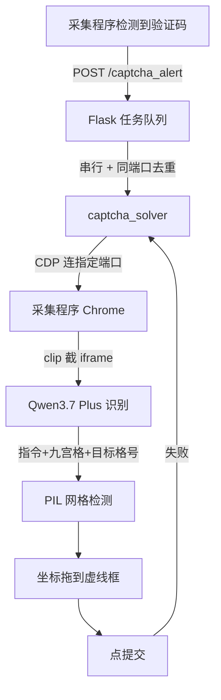

## 架构链路



## 关键配置

<CodeGroup>

```python 端口映射
# 百应浏览器：9340 + browser_index
# 淘宝浏览器：9335 固定
# 本地代理桥：9801 + browser_index
BUYIN_BROWSER_PORT = 9340
```

```python 识别调用
from openai import OpenAI

# Qwen3.7 Plus（百炼 MaaS）全图一次识别
# 返回 {instruction, grid, targets}
# 耗时约 6.4s，成本约 ¥0.007/次
```

</CodeGroup>

## 三条铁律

<Warning>
  **① 架构切换必须彻底废弃旧接口旧状态**

  旧 `/start_verify` 残留曾导致监控看板弹「参数错误[500][501]」——只加新不删旧会踩雷。
</Warning>

<Warning>
  **② 改代码必须重启 Flask**

  Python 模块缓存会让你以为改了代码却跑的是旧逻辑。
</Warning>

<Warning>
  **③ 验证码约 2 分钟时效**

  全流程必须 1 分钟内完成：截图 2s + 识别 6s + 拖拽 20s + 提交 10s ≈ 40s。
</Warning>

## 踩坑记录

<AccordionGroup>
  <Accordion title="cross-origin iframe 不进 page.frames" icon="bug">
    验证码 iframe（`rmc.bytedance.com`）用 CDP 连接的 Playwright 拿不到 Frame 对象，element screenshot 也因可见性检查超时。

    **解法**：iframe 元素 `bounding_box()` + `page.screenshot(clip=bbox)` 区域截图。
  </Accordion>

  <Accordion title="Qwen 9B thinking 模式慢 50 秒" icon="clock">
    本地 Qwen 9B 微调版默认 thinking 模式，单请求 50 秒。

    **解法**：llama-server 加 `--reasoning-budget 0`（立即结束思考）→ 0.6 秒。

    最终方案改用云端 Qwen3.7 Plus，本地 9B 已停用。
  </Accordion>

  <Accordion title="网格检测被干扰线误导" icon="grip">
    弹窗标题下划线和「拖放到这里」虚线框上边缘会干扰九宫格线检测。

    **解法**：要求 4 条线中至少 3 条真实候选命中（推算 ≤1）。
  </Accordion>

  <Accordion title="代理桥生命周期绑定 Chrome" icon="link-slash">
    `buyin_three_proxy_browsers.py` 默认启动 3 个 Chrome，Chrome 全退桥自动停 → 代理端口没了 → 浏览器拒绝启动（防 IP 暴露）。

    **解法**：用 `--no-launch` 模式只起代理，Chrome 交给采集程序自己起。
  </Accordion>
</AccordionGroup>

## 未实现

<Note>
  **拼图滑块**（"按住按钮拖动完成拼图"）当前不支持，遇到会识别失败转人工。
  OpenCV 缺口检测逻辑在旧 `auto_verify.py` 待移植。
</Note>
